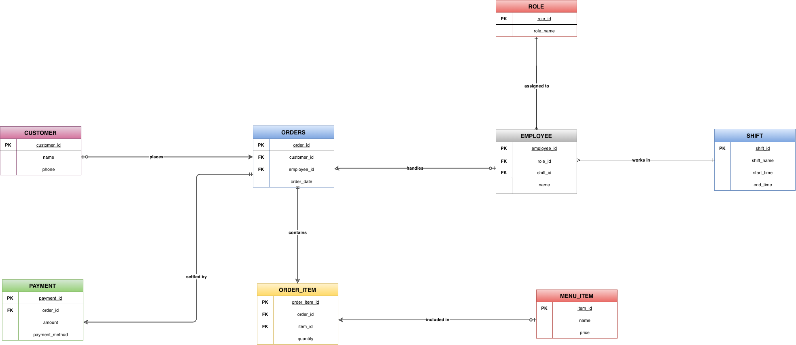

# Restaurant Order Management System

## Project Overview

This project is a relational database system designed to support daily restaurant operations.  
The system manages customers, employees, menu items, orders, payments, and business analytics in a structured and scalable way.

The main goal of the project was to design a normalized database structure that improves operational tracking and enables meaningful business insights through SQL queries.

---

## Business Problem

Restaurants handle multiple operational processes at the same time, including:
- customer management
- order tracking
- employee workload
- payment processing
- sales reporting

Without a structured system, tracking orders and analyzing business performance becomes difficult.

This project was designed to simulate a real restaurant management workflow and organize these processes inside a relational database system.

---

## System Features

- Customer management
- Employee & shift tracking
- Menu item management
- Order processing
- Payment tracking
- Revenue analysis
- Business insight reporting

---

## Database Design

The database was designed using normalization principles up to 3NF to reduce redundancy and improve data integrity.

### Main Entities
- Customer
- Employee
- Role
- Shift
- MenuItem
- Orders
- OrderItem
- Payment

The `OrderItem` table was used as an associative entity to manage the many-to-many relationship between orders and menu items.

---

## Business Analytics Queries

The project includes SQL queries for operational and managerial insights such as:

- Most popular menu items
- Daily revenue analysis
- Top spending customers
- Employee workload tracking
- Average order value
- Customers with no orders

---

## Technologies Used

- SQL
- Relational Database Design
- ER Modeling
- Normalization (3NF)

---

## Project Files

- ER Diagram
- Relational Schema
- SQL Script
- Sample Data
- SQL Queries
- Project Presentation

---

## Key Learning Outcomes

Through this project, I improved my understanding of:
- relational database design
- SQL query development
- normalization
- business-oriented analytics
- operational system modeling

## ER Diagram

